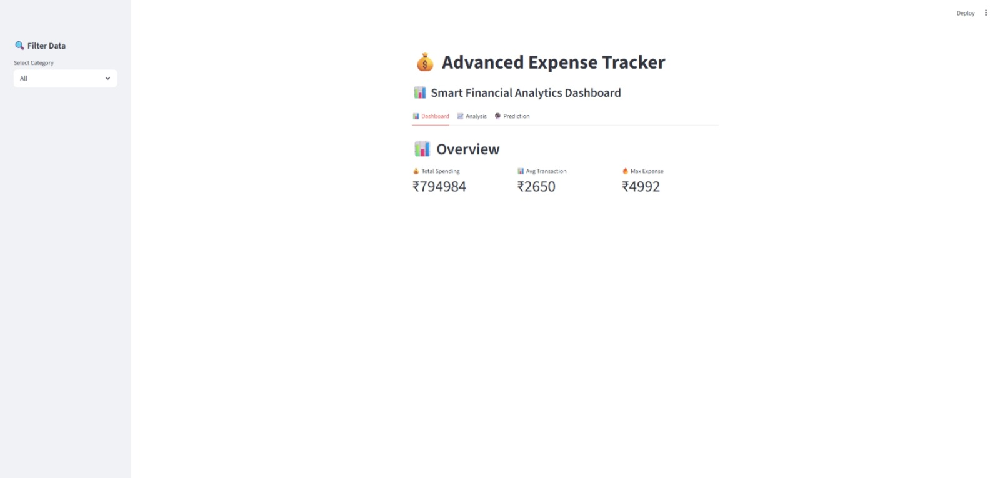
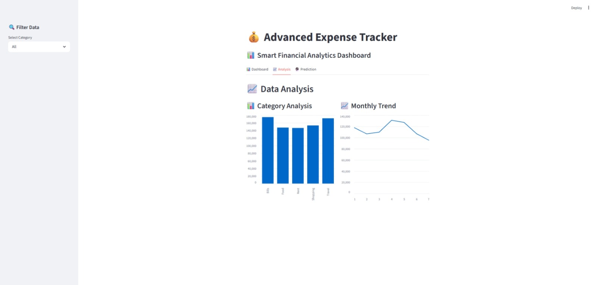
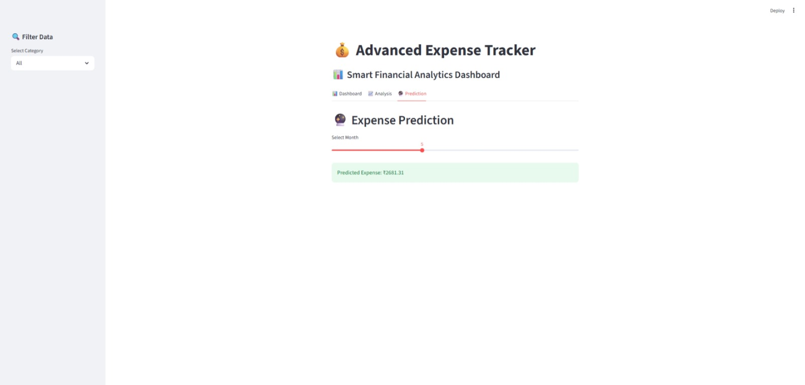

# 💰 AI Expense Tracker & Financial Analytics Dashboard

<p align="center">
  
  
  
  
  
</p>

<h1 align="center">💳 Advanced Expense Tracker</h1>

<p align="center">
📊 AI-Powered Personal Finance Analytics & Expense Prediction System
</p>

---

# 🌐 Live Demo

## 🚀 Open Live Dashboard

👉 https://ai-expense-tracker-bcnpvttthcqzcmsqfcs5rs.streamlit.app/

---

# 🖥 Dashboard Preview



---

# 📌 Project Overview

The AI Expense Tracker & Financial Analytics Dashboard is a professional FinTech and Data Science project developed using Python, Streamlit, SQLite, Machine Learning, and Data Visualization tools.

This project helps users track expenses, analyze spending habits, monitor financial behavior, and forecast future expenses using AI-powered analytics.

The dashboard simulates real-world financial systems used in modern FinTech platforms such as:

- 💳 Google Pay
- 💰 CRED
- 🏦 Razorpay
- 📱 PhonePe
- 💸 Paytm

The application transforms raw expense records into actionable financial insights through interactive dashboards and predictive analytics.

---

# ❗ Problem Statement

Managing personal finances manually is difficult because users often:

- 💸 Overspend without tracking
- 📉 Lack financial insights
- 📊 Cannot analyze spending behavior
- 🔮 Cannot predict future expenses
- 🧾 Struggle with budget planning

Traditional expense tracking methods provide limited analytics and no intelligent predictions.

This project solves these challenges using Data Science, Visualization, and Machine Learning techniques.

---

# 🎯 Project Objectives

✅ Track daily expenses efficiently  
✅ Analyze category-wise spending  
✅ Visualize monthly expense trends  
✅ Generate intelligent financial insights  
✅ Predict future expenses using ML  
✅ Build an interactive AI dashboard  
✅ Improve personal financial management  

---

# 🧠 AI Features

The dashboard includes several AI-powered financial analytics features:

- 📈 Expense Prediction
- 📊 Spending Trend Analysis
- 💳 Category-wise Analytics
- 🧾 Expense Visualization
- 📉 Monthly Financial Reports
- 🔮 Future Expense Forecasting
- 💡 Smart Financial Insights

---

# 🖥️ Dashboard Features

## 📌 Financial KPI Cards

The dashboard displays:

- 💰 Total Expenses
- 📈 Monthly Spending
- 📊 Average Expense
- 🛒 Highest Spending Category

---

## 📊 Interactive Visualizations

### 📈 Monthly Expense Trends

Visualizes monthly spending behavior over time.

---

### 🛒 Category-wise Expense Analysis

Displays spending distribution across categories such as:

- Food
- Shopping
- Travel
- Entertainment
- Bills
- Healthcare

---

### 📉 Expense Distribution Charts

Interactive pie charts and bar charts for financial analytics.

---

### 🔮 Expense Prediction

Uses Machine Learning models to predict future expenses.

---

### 📋 Expense Records Table

Displays complete transaction history and financial records.

---

# 🧠 AI Workflow

```text
User Expense Data
        ↓
SQLite / CSV Storage
        ↓
Data Cleaning
        ↓
Feature Engineering
        ↓
Financial Analysis
        ↓
Machine Learning Prediction
        ↓
Interactive Dashboard
        ↓
Financial Insights
```

---

# ⚙️ Technologies Used

| Technology | Purpose |
|---|---|
| Python | Core Programming |
| Pandas | Data Analysis |
| NumPy | Numerical Computing |
| Streamlit | Dashboard Development |
| Plotly | Interactive Charts |
| Matplotlib | Visualization |
| SQLite | Database Storage |
| Scikit-learn | Machine Learning |
| Joblib | Model Saving |
| GitHub | Version Control |
| Streamlit Cloud | Deployment |

---

# 📂 Project Structure

```text
Expense-Tracker-Advanced/
│
├── app/                  # Streamlit dashboard
├── src/                  # Core logic
├── data/                 # SQLite database
├── models/               # Trained ML models
├── outputs/              # Generated charts
├── images/               # Dashboard screenshots
├── README.md
├── requirements.txt
└── main.py
```

---

# 📊 Dataset Information

The dataset contains financial records including:

- Expense Amount
- Expense Category
- Transaction Date
- Monthly Spending
- Financial Patterns

The system processes this data to generate analytics and predict future expenses.

---

# 📸 Dashboard Screenshots

## 🖥 Main Dashboard


---

## 📊 Financial Charts



---

## 🔮 Expense Prediction



---

# 🚀 Installation Guide

## 1️⃣ Clone Repository

```bash
git clone https://github.com/sujalkrshaw/ai-expense-tracker.git
```

---

## 2️⃣ Open Project Folder

```bash
cd ai-expense-tracker
```

---

## 3️⃣ Install Dependencies

```bash
pip install -r requirements.txt
```

---

## 4️⃣ Run Main Pipeline

```bash
python main.py
```

---

## 5️⃣ Run Streamlit Dashboard

```bash
streamlit run app/app.py
```

---

# 🌐 Deployment

This project is deployed using Streamlit Community Cloud.

## 🚀 Live Website

https://ai-expense-tracker-bcnpvttthcqzcmsqfcs5rs.streamlit.app/

---

# 📈 Future Improvements

🔹 Mobile App Integration  
🔹 Real-time Expense Tracking  
🔹 AI Budget Recommendations  
🔹 Smart Budget Alerts  
🔹 Bank API Integration  
🔹 Voice-based Expense Entry  
🔹 AI Financial Assistant  

---

# 💼 Industry Relevance

Applicable in:

- 💳 FinTech Analytics
- 📊 Financial Data Analysis
- 🏦 Personal Finance Management
- 📈 Spending Behavior Analytics
- 🤖 AI-based Financial Systems

---

# 💡 Learning Outcomes

Through this project, I learned:

✅ Financial Data Analysis  
✅ Dashboard Development  
✅ Machine Learning Workflow  
✅ Expense Forecasting  
✅ Data Visualization  
✅ SQLite Database Handling  
✅ Streamlit Deployment  

---

# 👨‍💻 Author

## Sujal Kumar Shaw

🎓 B.Tech Student | Aspiring Data Scientist

### 🚀 Interests

- 📊 Data Science
- 💰 Financial Analytics
- 🤖 Artificial Intelligence
- 📈 Dashboard Development

---

# 🔗 Project Links

## 🌐 Live Demo

https://ai-expense-tracker-bcnpvttthcqzcmsqfcs5rs.streamlit.app/


---

# ⭐ Support

If you liked this project:

⭐ Star the repository  
🍴 Fork the project  
📢 Share the project  

---

# 📜 License

This project is developed for educational and portfolio purposes.

---

# 🚀 Final Note

This project demonstrates how AI, Machine Learning, Financial Analytics, and Data Visualization can be combined to build intelligent personal finance systems capable of tracking expenses, generating insights, and predicting future financial behavior.
